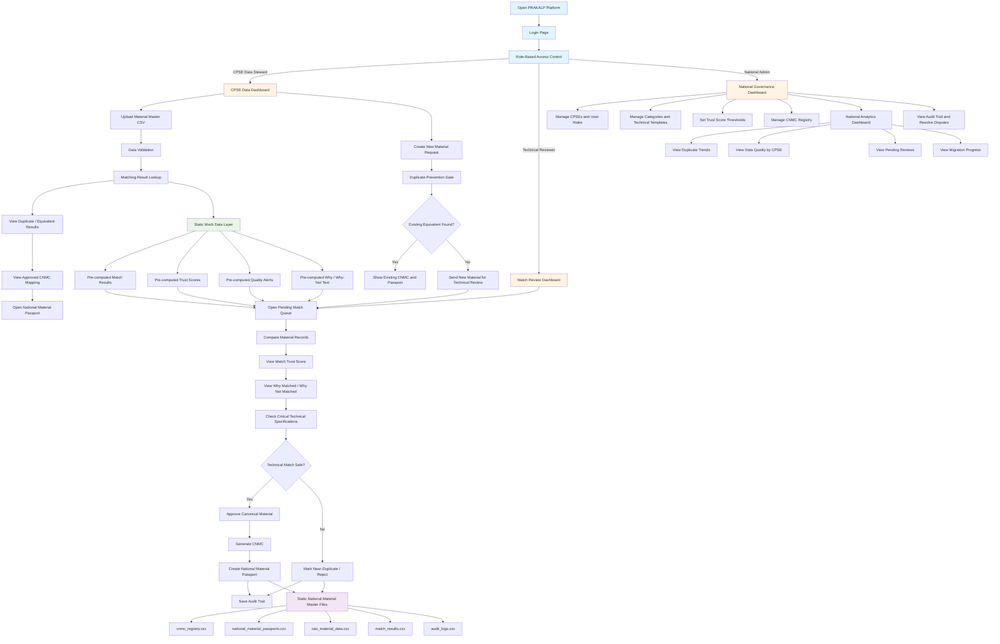

# 08 — Architecture

## Tech Stack

- **Frontend only.** React (with your standard routing/state setup).
- **No backend service** — no Node/Express/FastAPI server, no database.
- **Data layer:** static CSV and JSON files under `/mock_data/`, loaded
  client-side (CSV parsed with a lightweight parser, JSON loaded directly)
  through the `mockApi.ts` module described in `05-mock-api-contract.md`.
- **State:** in-memory only (React state/context). No persistence layer.
  A page refresh may reset any "write" actions (approvals, resolved alerts,
  etc.) back to the static baseline — that's expected for a prototype.
- **Hosting:** static build, deployable anywhere that serves static files.

## System Diagram

Note: box `H` ("Static Mock Data Layer") replaces what the original concept
brief called the "AI Material Intelligence Engine." For this build, it is
**only** a set of static files being read — nothing in the shaded `H` block
should be implemented as running code beyond a file read + filter.

## Deployment Note

Since there's no backend, there's no environment-variable/secrets
configuration to manage. The entire app is a static bundle plus the
`/mock_data/` directory served alongside it.
